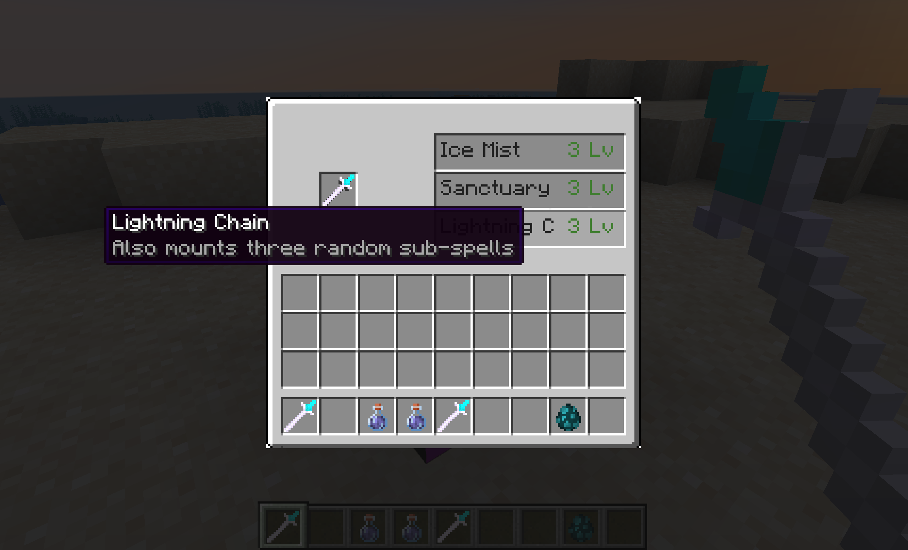

# Program Magic

Program Magic is a combat expansion mod for **Minecraft Forge 1.20.1**. I built it as a personal project to explore how a modular spell system could support different combinations without hard-coding every pair of spells.

The current version includes a playable wand, a spell-mounting workstation, ten spells, custom combat entities, and visual effects. My main focus was the engineering behind the combat system: event-driven spell composition, server-authoritative gameplay, and consistent handling of effects that remain active for multiple ticks.

> **Status:** The core combat loop and all ten spells are implemented. Balancing, multiplayer testing, asset polish, code cleanup, and small bug fixes are still in progress.

## Demo

### Spell Mounting Workstation



The custom workstation presents randomized main-spell offers, displays localized tooltips and experience costs, and mounts the selected main spell together with three sub-spells onto the wand.

### Lightning Chain Combat


A homogeneous Lightning Chain loadout demonstrates the spell-combination system: the main attack can chain between visible targets, while the three matching sub-spells respond to confirmed hits.

## Highlights

- A wand stores **one main spell and three sub-spells**.
- Sub-spells react to events such as confirmed hits, kills, and buffs instead of simply repeating a cast.
- Ten spells share a common framework across four casting styles: instant, sustained, formation, and buff.
- Each cast captures a loadout snapshot so delayed effects keep the correct configuration if the player changes presets.
- Damage, movement, status effects, spell selection, and experience costs are handled or validated on the server.
- The mod includes a custom workstation UI, English/Chinese localization, custom renderers, and a GeckoLib-animated wand.

## Gameplay and Spells

The player places a wand in the mounting workstation and spends experience levels to select a main spell. Three sub-spells are assigned to the same loadout. During combat, compatible sub-spells react to phases produced by the main spell.

Repeated copies can strengthen selected effects. For example, additional Fire Breath copies increase its damage, while additional Ice Mist copies increase its damage and duration.

| Category | Spell | Main effect | Sub-spell interaction |
| --- | --- | --- | --- |
| Instant | Thunder Chain | Lightning attack that can chain to extra targets with a homogeneous loadout | Calls down lightning after a confirmed hit |
| Sustained | Laser Beam | Charged beam with scalable damage, width, and duration | Converts part of confirmed damage into healing |
| Instant | Dark Devour | Directional execution zone with a health budget and self-backlash | May execute or damage a hit target |
| Instant | Blast Dash | Collision-checked dash ending in a non-block-breaking explosion | May create an explosion after a kill |
| Sustained | Fire Breath | Repeated cone damage and ignition | May ignite a hit target |
| Formation | Ice Mist | Damaging area that accumulates freeze | May create a smaller mist on a target |
| Formation | Sanctuary | Persistent combat area placed in front of the caster | Adds damage against undead targets |
| Formation | Thunder Storm | Pulls enemies inward and deals periodic damage | May create a pulling burst after a kill |
| Buff | Holy Blessing | Grants offensive and defensive bonuses to the caster and nearby allies | Applies blessing during compatible cast phases |
| Buff | Ice Shield | Gives the caster and nearby allies layered shields | Adds or restores a shield layer during supported phases |

## Architecture

### Event-driven spell composition

Every spell extends `BaseMagic`. Main behavior is implemented through `castAsMain(MagicContext)`, while secondary behavior is separated into `triggerAsSub(MagicContext)`. The shared dispatcher evaluates the three sub-spell slots independently, so a new spell can participate in the system without adding pair-specific logic to every existing class.

`MagicContext` carries the caster, target, position, loadout, damage result, event origin, and phase. Phases such as `CAST_BEGIN`, `AFTER_DAMAGE`, `ENTITY_HIT`, and `ENTITY_KILLED` let sub-spells respond only when their conditions are meaningful.

### Delayed effects and recursion safety

Beams, areas, buffs, storms, and dash controllers remain active after the initial input. `MagicLoadoutSnapshot` captures the four equipped spells at cast time, preventing delayed effects from reading a later preset.

`MagicOrigin` distinguishes primary attacks, sub-effects, shield counters, self-cost, and environmental damage. Only approved origins can dispatch sub-spells, preventing accidental trigger loops.

### Client-server separation

The client handles input, menus, animation, and rendering. The server validates workstation selections and experience costs, then executes damage, movement, status effects, and custom entity spawning. The wand loadout is stored through a Forge item capability and serialized to NBT.

## Project Structure

```text
src/main/java/com/yxty/examplemod/
|-- magic/        Spell framework and implementations
|-- entity/       Beams, areas, dashes, storms, and shields
|-- renderer/     Client-side spell and wand rendering
|-- capability/   Persistent wand and player magic data
|-- menu/         Workstation container and validation
|-- client/       Workstation screen and client registration
`-- item/         Wand input and GeckoLib integration
```

## Technology

- Java 17
- Minecraft Forge 47.4.0 / Minecraft 1.20.1
- GeckoLib 4.4.9
- Gradle and Mojang official mappings

## Build

```powershell
.\gradlew.bat runClient
.\gradlew.bat build
```

The packaged JAR is generated in `build/libs/`. GeckoLib for Forge 1.20.1 is required when running the mod outside the development environment.

## Next Steps

- Continue balancing and multiplayer edge-case testing.
- Improve temporary visual and audio assets.
- Add tests for phase dispatch, loadout snapshots, and recursive-trigger prevention.
- Remove remaining Forge MDK template names and fix smaller gameplay or rendering bugs.

## What I Learned

This project showed me that building a combat system involves more than implementing individual attacks. The harder problems were defining a stable event model, synchronizing client and server state, managing multi-tick effects, and preventing spell combinations from triggering recursively.

## License

See [LICENSE.txt](LICENSE.txt).
